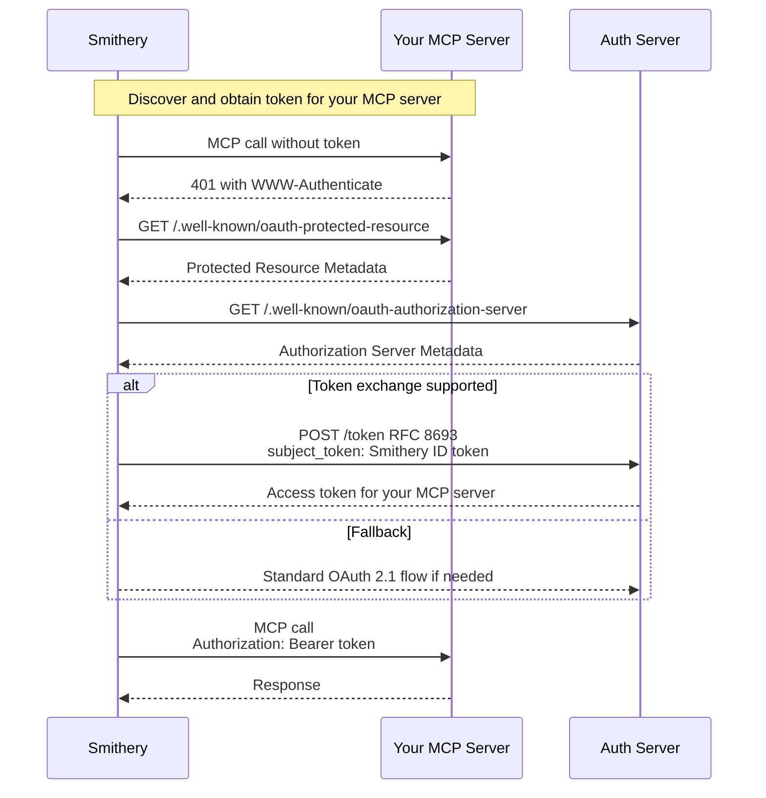

## Overview

Smithery Identity allows your MCP server to identify end users without requiring them to create separate accounts or manage API keys. When users connect to your server through Smithery, we use OAuth 2.0 Token Exchange (RFC 8693) to seamlessly obtain access tokens for your server on behalf of the user. This skips an extra OAuth screen and enables your MCP server to be used purely server-side.

### Key benefits
- **Zero-friction onboarding**: Users don't need to sign up separately for your service. This can boost traffic by 30%!
- **Works with existing auth**: Seamlessly integrates with OAuth 2.0 providers
- **Spec-compliant**: Uses standard OAuth 2.0 Token Exchange

### How it works

When a user calls your MCP server through Smithery:

1. Smithery detects your server requires authentication (401 response)
2. Smithery performs OAuth 2.0 Token Exchange with your authorization server
3. Your server receives a standard `Authorization: Bearer <token>` header
4. You validate the token and identify/provision the user

This approach is fully compliant with the MCP specification and OAuth 2.0 standards.

## Quick start with Smithery TypeScript SDK

When using the Smithery TypeScript SDK (see [TypeScript deployment guide](/build/deployments/typescript)), user authentication is handled automatically:

```typescript
import { McpServer } from "@modelcontextprotocol/sdk/server/mcp.js";

export default function createServer({ config, user }) {
  // user contains the authenticated user information:
  // - user.id: unique identifier from your auth system
  // - user.email: email address (if available)
  // - user.name: display name (if available)
  // - Additional claims from your OAuth provider
  
  const server = new McpServer({
    name: "Your Server",
    version: "1.0.0",
  });
  
  server.addTool({
    name: "get_user_data",
    handler: async () => {
      // User is already authenticated
      const data = await fetchUserData(user.id);
      return { data };
    }
  });
  
  return server.server;
}
```

**That's it!** The Smithery SDK handles:
- OAuth 2.0 token exchange negotiation
- Token validation
- User provisioning
- Passing the authenticated user to your server

## Manual integration

If you're not using the Smithery TypeScript SDK, you'll need to implement OAuth 2.0 Token Exchange support in your authorization server.

### 1. Enable Token Exchange on your OAuth server

Add a token exchange endpoint that accepts Smithery ID tokens:

```typescript
// Add token exchange support to your OAuth server
app.post('/oauth/token', async (req, res) => {
  const { grant_type, subject_token, subject_token_type } = req.body;
  
  if (grant_type === 'urn:ietf:params:oauth:grant-type:token-exchange') {
    // Verify the incoming Smithery OIDC ID token
    const smitheryToken = await verifySmitheryIdToken(subject_token);
    
    if (!smitheryToken) {
      return res.status(400).json({ error: 'invalid_request' });
    }
    
    // Create or lookup user based on Smithery identity
    const user = await findOrCreateUser({
      externalId: `smithery:${smitheryToken.sub}`,
      email: smitheryToken.email
    });
    
    // Issue access token for your MCP server
    const accessToken = await issueAccessToken(user);
    
    return res.json({
      access_token: accessToken,
      token_type: 'Bearer',
      expires_in: 3600
    });
  }
  
  // Handle other grant types...
});
```

### 2. Verify Smithery ID tokens

Smithery sends a standard OIDC ID token that must be validated according to OpenID Connect Core specification:

```typescript
import { createRemoteJWKSet, jwtVerify } from 'jose';

const SMITHERY_JWKS = createRemoteJWKSet(
  new URL('https://smithery.ai/.well-known/jwks.json')
);

async function verifySmitheryIdToken(token: string) {
  try {
    // Validate according to OIDC Core spec:
    // - Signature verification using RS256
    // - Public key from well-known JWKS
    // - Valid iss, aud, exp, nbf claims
    const { payload } = await jwtVerify(token, SMITHERY_JWKS, {
      issuer: 'https://smithery.ai',
      audience: '@your-org/your-server', // Your server's qualified name
      algorithms: ['RS256']
    });
    
    return payload;
    // Standard OIDC claims:
    // - iss: "https://smithery.ai"
    // - sub: pairwise user identifier
    // - aud: your server's qualified name
    // - exp: expiration time
    // - nbf: not before time
    // - iat: issued at time
    // Optional claims:
    // - email: user's email
    // - name: user's name
  } catch (error) {
    console.error('Invalid Smithery token:', error);
    return null;
  }
}
```

### 3. Configure OAuth metadata

Your server needs to advertise token exchange support:

```json
// .well-known/oauth-protected-resource
{
  "resource": "https://your-server.example.com",
  "authorization_servers": ["https://auth.example.com"]
}

// auth.example.com/.well-known/oauth-authorization-server
{
  "issuer": "https://auth.example.com",
  "token_endpoint": "https://auth.example.com/oauth/token",
  "grant_types_supported": [
    "authorization_code",
    "urn:ietf:params:oauth:grant-type:token-exchange"
  ],
  "token_endpoint_auth_methods_supported": ["none"],
  "subject_token_types_supported": [
    "urn:ietf:params:oauth:token-type:id_token"
  ]
}
```

### 4. Handle authenticated MCP requests

Your MCP server receives standard OAuth Bearer tokens:

```typescript
// Validate the access token from Authorization header
const token = req.headers.authorization?.replace('Bearer ', '');
const user = await validateAccessToken(token);

// Process MCP request with authenticated user context
```

## Token Exchange flow



## Security considerations

### ID Token validation
The Smithery ID token is a standard OIDC ID token that must be validated according to OpenID Connect Core specification:
- **Algorithm**: RS256 signature verification
- **Keys**: Public keys available via JWKS at `https://smithery.ai/.well-known/jwks.json`
- **Required claims**: `iss`, `aud`, `exp`, `nbf`, `sub`
- **Issuer**: Must be `https://smithery.ai`
- **Audience**: Must match your server's qualified name

### Privacy
- The `sub` claim is pairwise - unique to your server
- Users cannot be tracked across different MCP servers
- Only request PII (email, name) if necessary

### Trust relationship
- By accepting Smithery ID tokens, you trust Smithery's user authentication
- Consider implementing additional verification for sensitive operations

## FAQ

### Do I need my own OAuth server?

If using the Smithery TypeScript SDK, no - it's handled for you. For manual integration, yes - you need an OAuth 2.0 authorization server that supports token exchange.

### What about servers that don't need authentication?

Anonymous servers don't need any of this - Smithery will call them directly without authentication.

### How do I handle existing users?

You can provide an account linking flow where existing users associate their account with their Smithery identity during the first token exchange.

### What's the performance impact?

Token exchange happens once per user session. Smithery caches the resulting access token according to your server's token lifetime.

## Reference

### Smithery ID Token
- **Type**: OIDC ID Token (`urn:ietf:params:oauth:token-type:id_token`)
- **Algorithm**: RS256
- **Issuer**: `https://smithery.ai`
- **Audience**: Your server's qualified name (e.g., `@smithery/weather-server`)
- **JWKS URL**: `https://smithery.ai/.well-known/jwks.json`

### Token Exchange
- **Grant Type**: `urn:ietf:params:oauth:grant-type:token-exchange`
- **Subject Token Type**: `urn:ietf:params:oauth:token-type:id_token`

## Learn more

- [RFC 8693: OAuth 2.0 Token Exchange](https://datatracker.ietf.org/doc/html/rfc8693)
- [OpenID Connect Core 1.0](https://openid.net/specs/openid-connect-core-1_0.html)
- [MCP Authorization Specification](https://modelcontextprotocol.io/docs/spec/authentication)
- [OAuth 2.0 Protected Resource Metadata](https://datatracker.ietf.org/doc/html/draft-ietf-oauth-resource-metadata)