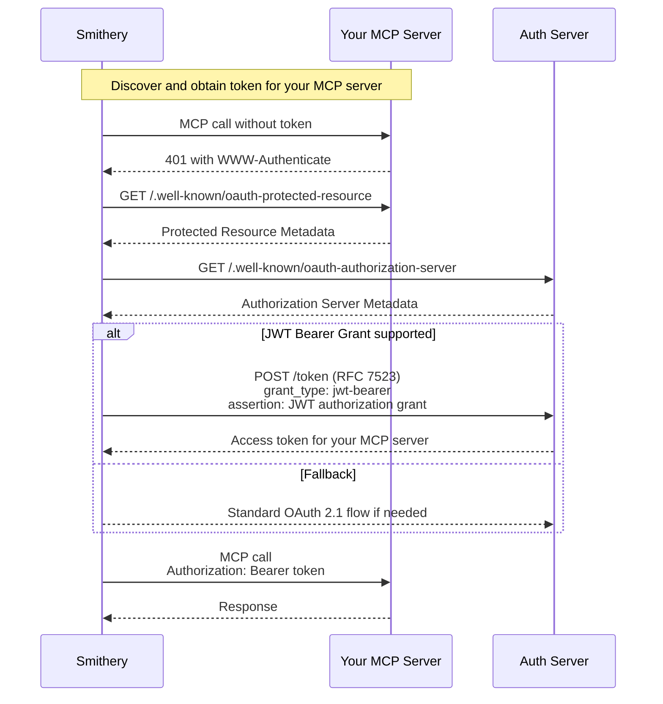

## Overview

Smithery Identity allows your MCP server to identify end users without requiring them to create separate accounts or manage API keys. When users connect to your server through Smithery, we seamlessly obtain access tokens for your server on behalf of the user using OAuth 2.0 JWT Authorization Grants [(RFC 7523)](https://datatracker.ietf.org/doc/html/rfc7523). This skips an extra OAuth screen and enables your MCP server to be used purely server-side.

### Key benefits
- **Zero-friction onboarding**: Users don't need to sign up separately for your service. This can boost traffic by 30%!
- **Works with existing auth**: Seamlessly layers on top of OAuth 2.0
- **Spec-compliant**: Uses standard OAuth 2.0 JWT Bearer Authorization Grants, compatible with [Enterprise-Ready MCP spec](https://github.com/modelcontextprotocol/modelcontextprotocol/pull/646).

## Quick start

Implement ID-JAG by exporting `identity` to mint access tokens and `oauth` to verify them.

```typescript
import type { AuthInfo } from "@modelcontextprotocol/sdk/server/auth/types.js"
import { McpServer } from "@modelcontextprotocol/sdk/server/mcp.js"
import type { IdentityHandler } from "@smithery/sdk/server/auth/identity.js"
import type { TokenVerifier } from "@smithery/sdk"
import { SignJWT, jwtVerify } from "jose"

const HMAC_SECRET = new TextEncoder().encode(process.env.MY_SERVER_SECRET ?? "dev-secret")

export default function createServer({ auth }: { auth: AuthInfo }) {
  const server = new McpServer({ name: "My MCP Server", version: "1.0.0" })
  const userId = typeof auth?.extra?.userId === "string" ? auth.extra.userId : undefined // [!code highlight]

  server.tool(
    "whoami",
    "Return the authenticated user id",
    {},
    async () => {
      return { content: [{ type: "text", text: JSON.stringify({ userId }) }] }
    },
  )

  return server.server
}

export const identity: IdentityHandler = { // [!code highlight]
  handleJwtGrant: async claims => {
    if (!claims.sub) return null
    // Smithery provides a set of claims about the user to your server

    // Mint an access token for your MCP using your own signing
    const token = await new SignJWT({ userId: claims.sub })
      .setProtectedHeader({ alg: "HS256" })
      .setExpirationTime("1h")
      .sign(HMAC_SECRET)

    return {
      access_token: token,
      token_type: "Bearer",
      expires_in: 3600,
      extra: { userId: claims.sub }, // forwarded to createServer via auth.extra
    }
  },
}

export const oauth: TokenVerifier = { // [!code highlight]
  verifyAccessToken: async token => {
    const { payload } = await jwtVerify(token, HMAC_SECRET)
    const userIdClaim = typeof payload.userId === "string" ? payload.userId : undefined
    return {
      clientId: "my-mcp",
      token,
      scopes: [],
      expiresAt: payload.exp ? payload.exp * 1000 : undefined,
      extra: { userId: userIdClaim }, // available as auth.extra in createServer
    }
  },
}
```

## Manual integration

If you're not using the Smithery TypeScript SDK, you'll need to implement OAuth 2.0 JWT Bearer Authorization Grant support in your authorization server.

### 1. Enable JWT Bearer Grant on your OAuth server

Add JWT bearer grant support to your token endpoint:

```typescript
// Add JWT bearer grant support to your OAuth server
app.post('/oauth/token', async (req, res) => {
  const { grant_type, assertion } = req.body;
  
  if (grant_type === 'urn:ietf:params:oauth:grant-type:jwt-bearer') { // [!code highlight]
    // Verify the incoming JWT authorization grant
    const jwtGrant = await verifyJwtAuthorizationGrant(assertion); // [!code highlight]
    
    if (!jwtGrant) {
      return res.status(400).json({ error: 'invalid_grant' });
    }
    
    // Create or lookup user based on the grant
    const user = await findOrCreateUser({ // [!code highlight]
      externalId: `smithery:${jwtGrant.sub}`, // [!code highlight]
      email: jwtGrant.email // [!code highlight]
    }); // [!code highlight]
    
    // Issue access token for your MCP server
    const accessToken = await issueAccessToken(user);
    
    return res.json({
      access_token: accessToken,
      token_type: 'Bearer',
      expires_in: 3600
    });
  }
  
  // Handle other grant types...
});
```

### 2. Verify JWT Authorization Grants

Validate the JWT authorization grant according to RFC 7523:

```typescript
import { createRemoteJWKSet, jwtVerify } from 'jose';

const SMITHERY_JWKS = createRemoteJWKSet( // [!code highlight]
  new URL('https://server.smithery.ai/.well-known/jwks.json') // [!code highlight]
); // [!code highlight]

async function verifyJwtAuthorizationGrant(assertion: string) {
  try {
    // Validate according to RFC 7523:
    // - Signature verification using RS256
    // - Public key from issuer's JWKS
    // - Valid iss, aud, exp, sub claims
    const { payload } = await jwtVerify(assertion, SMITHERY_JWKS, { // [!code highlight]
      issuer: 'https://server.smithery.ai', // [!code highlight]
      audience: 'https://your-server.example.com/oauth/token', // Your token endpoint // [!code highlight]
      algorithms: ['RS256'] // [!code highlight]
    }); // [!code highlight]
        
    return payload;
    // Required claims:
    // - iss: issuer (e.g., "https://server.smithery.ai")
    // - sub: user identifier
    // - aud: your token endpoint URL
    // - exp: expiration time
    // - iat: issued at time
    // Optional claims:
    // - email: user's email
    // - name: user's name
  } catch (error) {
    console.error('Invalid JWT grant:', error);
    return null;
  }
}
```

### 3. Configure OAuth metadata

Your server needs to advertise JWT bearer grant support:

```json
// .well-known/oauth-protected-resource
{
  "resource": "https://your-server.example.com",
  "authorization_servers": ["https://auth.example.com"]
}

// auth.example.com/.well-known/oauth-authorization-server
{
  "issuer": "https://auth.example.com",
  "token_endpoint": "https://auth.example.com/oauth/token",
  "grant_types_supported": [
    "authorization_code",
    "urn:ietf:params:oauth:grant-type:jwt-bearer" // [!code highlight]
  ],
  "token_endpoint_auth_signing_alg_values_supported": ["RS256"],
  ...
}
```

### 4. Handle authenticated MCP requests

Your MCP server receives standard OAuth Bearer tokens:

```typescript
// Validate the access token from Authorization header
const token = req.headers.authorization?.replace('Bearer ', '');
const user = await validateAccessToken(token);

// Process MCP request with authenticated user context
```

## How it works

When a Smithery-authenticated user calls your MCP server through Smithery:

1. Smithery detects your server requires authentication (401 response)
2. Smithery obtains an access token from your authorization server using a JWT Authorization Grant (RFC 7523)
3. Smithery retries the request with the newly-obtained access token
4. Your server receives the access token in a standard `Authorization: Bearer <token>` header
5. You validate the token and identify the user

### Technical details

Smithery uses an **ID-JAG (Identity JWT Authorization Grant)** to authenticate users with your authorization server:

- **Grant type**: `urn:ietf:params:oauth:grant-type:jwt-bearer` 
- **Transport**: POST to your token endpoint with `assertion` parameter containing the JWT
- **JWT claims**:
  - `iss`: Issuer (e.g., `https://server.smithery.ai`)
  - `sub`: Stable user identifier
  - `aud`: Your token endpoint URL
  - `exp`, `iat`: Expiration and issued-at times
  - `jti`: Unique identifier for replay protection
  - Optional: `email`, `name` for user profile data

This approach is fully compliant with RFC 7523 and the MCP OAuth specification.

### Detailed flow



## Security considerations

### JWT Grant validation
The JWT authorization grant must be validated according to RFC 7523:
- **Algorithm**: RS256 signature verification
- **Keys**: Public keys available via JWKS at `https://server.smithery.ai/.well-known/jwks.json`
- **Required claims**: `iss`, `aud`, `exp`, `sub`, `iat`, `jti`
- **Issuer**: Must be `https://server.smithery.ai` or your trusted issuer
- **Audience**: Must be your token endpoint URL
- **Replay protection**: Track `jti` to ensure single-use

### Privacy
- The `sub` claim is unique to your server
- Users cannot be tracked across different MCP servers
- Only request PII (email, name) if necessary

### Trust relationship
- By accepting JWT authorization grants from Smithery, you trust Smithery's user authentication
- Consider implementing additional verification for sensitive operations

## FAQ

### Do I need my own OAuth server?

If using the Smithery TypeScript SDK, no - it's handled for you. For manual integration, yes - you need an OAuth 2.0 authorization server that supports JWT bearer grants (RFC 7523).

### What about servers that don't need authentication?

Anonymous servers don't need any of this - Smithery will call them directly without authentication.

### How do I handle existing users?

You can provide an account linking flow where existing users associate their account with their Smithery identity during the first JWT grant validation.

### What's the performance impact?

JWT grant authentication happens once per user session. Smithery caches the resulting access token according to your server's token lifetime.

## Reference

### JWT Authorization Grant (ID-JAG)
- **Type**: JWT Bearer Authorization Grant
- **Algorithm**: RS256
- **Issuer**: `https://server.smithery.ai`
- **Audience**: Your token endpoint URL (e.g., `https://auth.example.com/oauth/token`)
- **JWKS URL**: `https://server.smithery.ai/.well-known/jwks.json`

### OAuth Parameters
- **Grant Type**: `urn:ietf:params:oauth:grant-type:jwt-bearer`
- **Assertion**: JWT authorization grant

## Learn more

- [RFC 7523: JWT Profile for OAuth 2.0 Client Authentication and Authorization Grants](https://datatracker.ietf.org/doc/html/rfc7523)
- [OpenID Connect Core 1.0](https://openid.net/specs/openid-connect-core-1_0.html)
- [MCP Authorization Specification](https://modelcontextprotocol.io/docs/spec/authentication)
- [OAuth 2.0 Protected Resource Metadata](https://datatracker.ietf.org/doc/html/draft-ietf-oauth-resource-metadata)