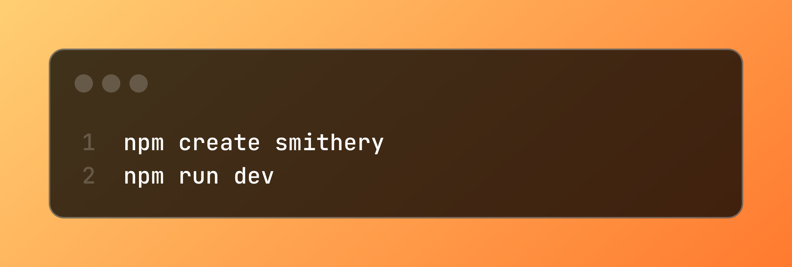
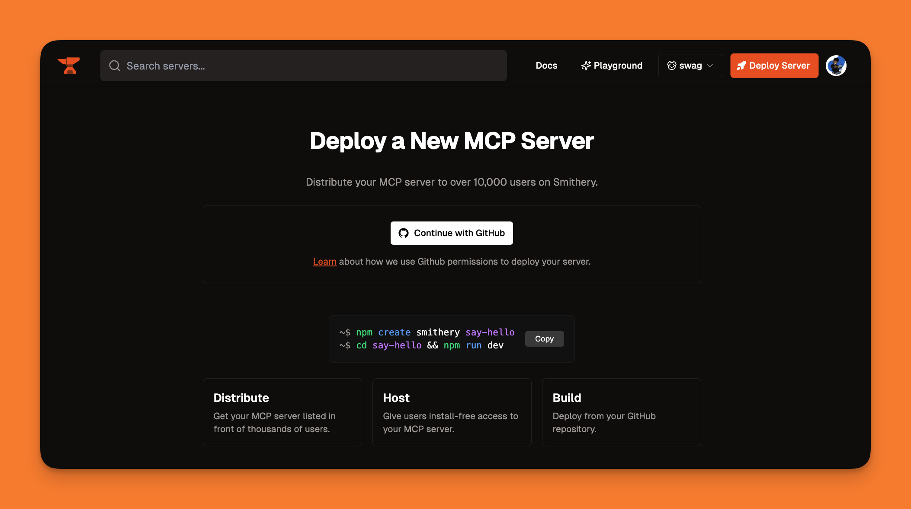

In this quickstart, we'll build a simple MCP server that says hello to users. We'll use the official TypeScript MCP SDK with the Smithery CLI. 

For other languages like Python, check out our [custom container guide](/cookbooks/python_custom_container).

### Prerequisites

- [Node.js](https://nodejs.org/) >18 (includes npm)
- A [Smithery API key](https://smithery.ai) for development features

### 1. Initialize the Server

```bash
npm create smithery
```

This sets up a TypeScript MCP server scaffold with example code and all necessary dependencies.

### 2. Edit the Server

In `src/index.ts`, you'll see a default server that says hello to a given name. Edit it to add your own tools.

Here's the basic structure:

```typescript
import { McpServer } from "@modelcontextprotocol/sdk/server/mcp.js";
import { z } from "zod";

// Optional: Configuration schema for session
// export const configSchema = z.object({
//   debug: z.boolean().default(false).describe("Enable debug logging"),
// });

export default function createServer({ config }) {
  const server = new McpServer({
    name: "Say Hello",
    version: "1.0.0",
  });

  // Add a tool
  server.registerTool("hello", {
    title: "Hello Tool",
    description: "Say hello to someone",
    inputSchema: { name: z.string().describe("Name to greet") },
  }, async ({ name }) => ({
    content: [{ type: "text", text: `Hello, ${name}!` }],
  }));

  return server.server;
}
```

<Expandable title="Full scaffold code with examples">
### Complete Code
The scaffold actually includes examples for tools, resources, and prompts:

```typescript
import { McpServer } from "@modelcontextprotocol/sdk/server/mcp.js"
import { z } from "zod"

// Optional: If you have user-level config, define it here
// This should map to the config in your smithery.yaml file
export const configSchema = z.object({
	debug: z.boolean().default(false).describe("Enable debug logging"),
})

export default function createServer({
	config,
}: {
	config: z.infer<typeof configSchema> // Define your config in smithery.yaml
}) {
	const server = new McpServer({
		name: "Say Hello",
		version: "1.0.0",
	})

	// Add a tool
	server.registerTool(
		"hello",
		{
			title: "Hello Tool",
			description: "Say hello to someone",
			inputSchema: { name: z.string().describe("Name to greet") },
		},
		async ({ name }) => ({
			content: [{ type: "text", text: `Hello, ${name}!` }],
		}),
	)

	// Add a resource
	server.registerResource(
		"hello-world-history",
		"history://hello-world",
		{
			title: "Hello World History",
			description: "The origin story of the famous 'Hello, World' program",
		},
		async uri => ({
			contents: [
				{
					uri: uri.href,
					text: '"Hello, World" first appeared in a 1972 Bell Labs memo by Brian Kernighan and later became the iconic first program for beginners in countless languages.',
					mimeType: "text/plain",
				},
			],
		}),
	)

	// Add a prompt
	server.registerPrompt(
		"greet",
		{
			title: "Hello Prompt",
			description: "Say hello to someone",
			argsSchema: {
				name: z.string().describe("Name of the person to greet"),
			},
		},
		async ({ name }) => {
			return {
				messages: [
					{
						role: "user",
						content: {
							type: "text",
							text: `Say hello to ${name}`,
						},
					},
				],
			}
		},
	)

	return server.server
}
```

You can remove the resource and prompt examples if you don't need them, or use them as templates for your own implementations.
</Expandable>

<Expandable title="Configuration Schema">
### Configuration Schema

Smithery allows users to customize server behavior for each session by providing API keys, adjusting settings, or modifying operational parameters. Export a `configSchema` using Zod to define what configuration your server accepts:

```typescript
export const configSchema = z.object({
  apiKey: z.string().describe("Weather API key"),
  temperatureUnit: z.enum(["celsius", "fahrenheit"]).default("celsius").describe("Temperature unit preference"),
});
```
</Expandable>

### 3. Running the Server

```bash
npm run dev
```

This will port-forward your local server to the Smithery Playground via ngrok. You can now test your server by prompting something like "Say hello to Henry". You can also reference the [Smithery CLI](https://github.com/smithery-ai/cli) for more controls.

### 4. Deploying the Server



Deployment is a one-click process. Just [make a GitHub repo](https://github.com/new) and [click "Deploy" on the Smithery home page](https://smithery.ai/new).


