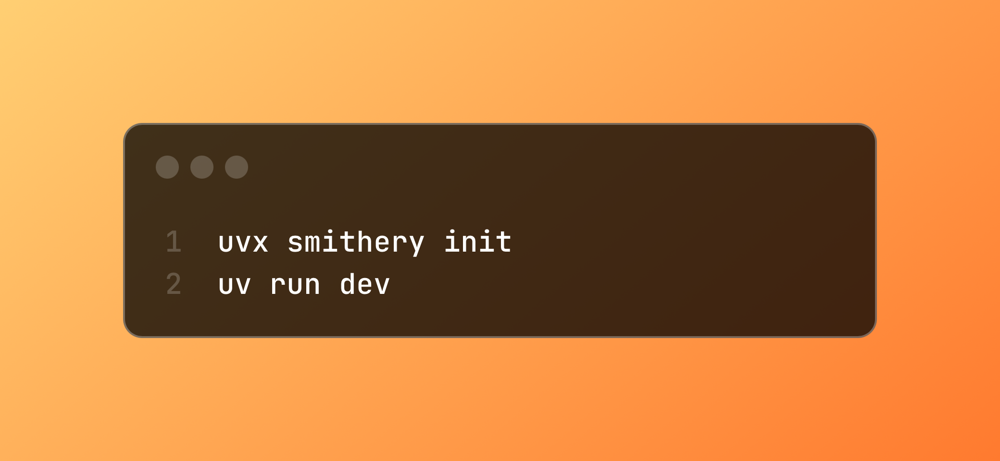

In this quickstart, we'll build a simple MCP server that says hello to users. We'll use the official Python MCP SDK with the Smithery CLI. By the end, you'll have a live, deployed server with built-in authentication that you can connect to from any MCP client.

For TypeScript, check out our [TypeScript quickstart guide](/getting_started/quickstart_build_typescript).

### Prerequisites

- [Python](https://python.org/) >=3.10
- [uv](https://docs.astral.sh/uv/getting-started/installation/) (Python package manager)
- A [Smithery API key](https://smithery.ai) for development features
- [Node.js](https://nodejs.org/) (optional, for local playground testing)

### 1. Initialize the Server

```bash
uvx smithery init
```

This sets up a Python MCP server scaffold with example code and all necessary dependencies.


### 2. Edit the Server

In `src/hello_server/server.py`, you'll see a default server that says hello to a given name. Edit it to add your own tools, resources, and prompts.

Here's the basic structure:

```python
from pydantic import BaseModel, Field

from smithery import smithery # [!code highlight]

# Optional: Configuration schema for session
class ConfigSchema(BaseModel):
    access_token: str = Field(..., description="Your access token for authentication")
    capitalize: bool = Field(True, description="Whether to capitalize the greeting")

@smithery(config_schema=ConfigSchema, name="Say Hello") # [!code highlight]
def create_server(server, config: ConfigSchema): # [!code highlight]
    """Create and configure the MCP server."""

    # Add a tool
    @server.tool() # [!code highlight]
    def hello(name: str) -> str: # [!code highlight]
        """Say hello to someone.""" # [!code highlight]
        ctx = server.get_context() # [!code highlight]
        config = ctx.session_config # [!code highlight]
        
        greeting = f"Hello, {name}!" # [!code highlight]
        return greeting.upper() if config.capitalize else greeting.lower() # [!code highlight]

    # The scaffold also includes example resources and prompts
    # @server.resource("example://resource")
    # @server.prompt()

    return server
```

<Accordion title="How does the @smithery decorator work?">
The `@smithery` decorator streamlines server creation by automatically:
- Creating a FastMCP server instance with your specified name
- Adding CORS handling for web-based clients
- Setting up session-level configuration management
- Applying Smithery deployment patches

You simply configure your tools, resources, and prompts on the provided `server` parameter, and the decorator handles all the deployment infrastructure automatically.
</Accordion>

<Accordion title="How does Smithery find your server?">
The scaffold creates a `pyproject.toml` file with this configuration:

```toml
[tool.smithery]
server = "hello_server.server:create_server"
```

This tells Smithery exactly where to find your server function using Python's import syntax: `module.path:function_name`. The `@smithery` decorator then provides all the configuration metadata (config schema, server name, etc.).
</Accordion>

<Tip>
**Adding config schema (optional)**

Smithery allows users to customize server behavior for each session by providing API keys, adjusting settings, or modifying operational parameters. Define a `ConfigSchema` using Pydantic and pass it to the `@smithery` decorator:

```python
class ConfigSchema(BaseModel):
    api_key: str = Field(..., description="Weather API key")
    temperature_unit: str = Field("celsius", description="Temperature unit preference")
    debug: bool = Field(False, description="Enable debug logging")

@smithery(config_schema=ConfigSchema, name="Weather Server")
def create_server(server, config: ConfigSchema):
    # Your server configuration here
```
</Tip>

### 3. Testing the Server

```bash
uv run dev
```

This will port-forward your local server to the Smithery Playground via ngrok. You can now test your server by prompting something like "Say hello to Henry".

For interactive testing, you can also use:

```bash
uv run playground
```

### 4. Deploy the Server


Deployment is a one-click process. Just [make a GitHub repo](https://github.com/new), push your local changes, and then [click "Deploy" on the Smithery home page](https://smithery.ai/new).


