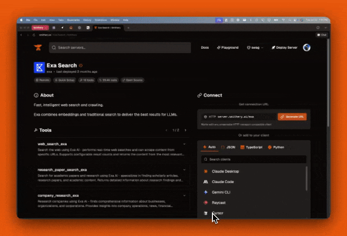

# One-click Connect to Smithery Servers

Smithery lets you add an authenticated connection to an MCP server in one click. Try [Exa](https://smithery.ai/server/exa) for free to search the web.

This will run an `npx` command that will start a local STDIO server that will hit the remote server on Smithery.
For more information on the CLI, see our [GitHub repo](https://github.com/smithery-ai/cli).

# Use Playground to Try Out Servers

The [Smithery Playground](https://smithery.ai/playground) lets you try out servers without installing them!
You can also use the Playground to try external servers with your Smithery profile. Just click "Add Servers", paste in the server URL, and click "Connect".

Playground is fully MCP compliant, including features like OAuth for secure authentication.
