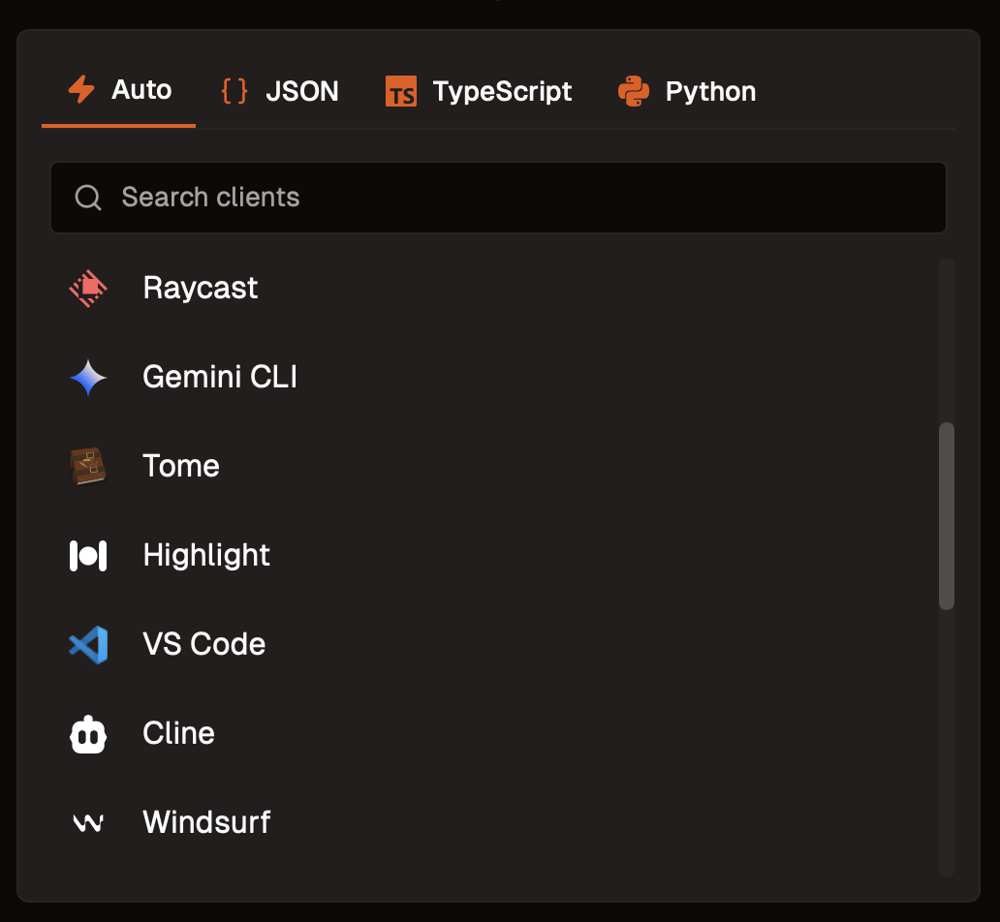

We offer client developers the opportunity to have their MCP clients listed on server pages within the Smithery platform. This provides easy installation and discovery for end users looking to connect to MCP servers.

## Benefits of Getting Listed

When your client is listed on Smithery:

- **Increased Visibility**: Your client appears on relevant server pages, making it easier for users to discover
- **Easy Installation**: Users can quickly install and connect your client to servers using [deep linking](/use/deep-linking) or the [Smithery CLI](/concepts/cli)
- **Better User Experience**: Simplified onboarding process for users wanting to use MCP servers

## How to Get Listed

To get your MCP client listed on Smithery, please contact us at [contact@smithery.ai](mailto:contact@smithery.ai) or join our [Discord community](https://discord.gg/sKd9uycgH9) for support.

## Attribution Requirements

To maintain the quality and discoverability of the MCP ecosystem, we require attribution back to Smithery. You can fulfill this requirement in one of the following ways:

### Option 1: Registry API Integration
Integrate directly with our registry to help users discover more servers:
- Use our [Registry API](/concepts/registry_search_servers) to fetch and display available servers
- This creates a seamless experience for users to explore MCP servers

### Option 2: Backlink Integration
Include a link back to Smithery to help users explore more servers:
- Add a "Explore more servers" link that directs users to [smithery.ai](https://smithery.ai)
- This can be placed in your client's interface, or settings

